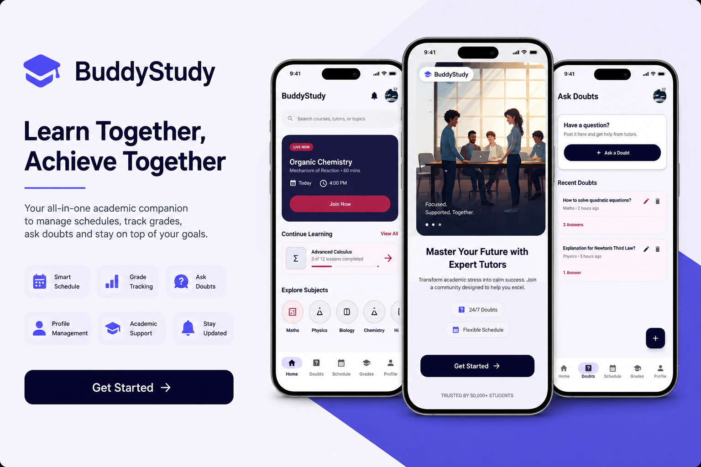

#  BuddyStudy

<p align="center">
  
</p>

<p align="center">
  <b>An Android mobile application that helps university students organize their academic life through schedule management, grade tracking, academic doubt management, and profile management.</b>
</p>

---

##  Project Overview

BuddyStudy is an Android application developed using **Kotlin** and **Android Studio** to simplify students' academic activities. The application provides an easy-to-use interface for managing study schedules, tracking grades, posting academic doubts, and maintaining personal profile information.

This project was developed as a **Mobile Application Development (MAD) Mini Project**.

---

#  Features

 - User Registration
- User Login
 - Password Recovery
- OTP Verification
- Reset Password
- Home Dashboard
 - Study Schedule Management (CRUD)
 - Grade Management (CRUD)
 - Academic Doubt Management (CRUD)
 - User Profile Management (CRUD)
 - Material Design User Interface
 - Bottom Navigation
 - Local Data Storage using SharedPreferences

---


#  Technologies Used

- Kotlin
- Android Studio
- XML
- Material Design Components
- SharedPreferences
- Android SDK
- Gradle

---


#  Main Modules

##  Authentication Module

- User Registration
- Login
- Forgot Password
- OTP Verification
- Reset Password

---

##  Schedule Management

- Add Schedule
- Edit Schedule
- Delete Schedule
- View Upcoming Sessions

---

##  Grade Management

- Add Grades
- Edit Grades
- Delete Grades
- Track Academic Performance

---

##  Doubt Management

- Create Doubts
- View Doubts
- Edit Doubts
- Delete Doubts

---

##  Profile Management

- Create Profile
- Edit Profile
- Delete Profile
- View User Information

---

#  Installation

### Clone the repository

```bash
git clone https://github.com/Uvindukumarage-code/MAD-Mni-Project.git
```

### Open the project

Open the project using **Android Studio**.

### Sync Gradle

Allow Android Studio to download all required dependencies.

### Run the application

Connect an Android device or start an emulator, then click **Run **.

---

#  Sustainable Development Goal

This project supports:

## SDG 4 – Quality Education

BuddyStudy contributes to improving the quality of education by helping students organize their academic activities, manage study schedules, monitor grades, and seek academic assistance through an easy-to-use mobile application.

---


#  Developers

This project was developed as part of the **Mobile Application Development (MAD)** module.

| Student ID | Name |
|------------|------|
| ITBNM-2313-0043 | Uvindu Kumarage |
| ITBNM-2313-0045 | Praveen Madhubashitha |
| ITBNM-2313-0046 | U.A. Manula Maduranga |
| ITBNM-2313-0051 | S.M.K. Mihiran |
| ITBNM-2313-0083 | Udara Welathanthri |
---


#  Team Contributions

| Team Member | Contribution |
|-------------|--------------|
| **Uvindu Kumarage** | Schedule Management Module (Create, Read, Update, Delete) |
| **Praveen Madhubashitha** | Grade Management Module (Create, Read, Update, Delete) |
| **U.A. Manula Maduranga** | Authentication Module (Login, Registration, OTP Verification, Password Reset)
| **S.M.K. Mihiran** | Doubt Management Module (Create, Read, Update, Delete) |
| **Udara Welathanthri** | Profile Management Module (Create, Read, Update, Delete) |

> **Note:** Each module of this project was developed independently by the assigned team member. To simplify project integration and meet submission deadlines, all source code was consolidated and committed to the GitHub repository using a single team member's GitHub account. As a result, the repository's contribution graph reflects only the account used for integration rather than the individual development contributions of the entire team.
> 
#  Future Improvements

- Firebase Authentication
- Cloud Firestore Integration
- Push Notifications
- Dark Mode
- AI Study Assistant
- Live Chat with Tutors
- Calendar Synchronization
- File Sharing
- Online Study Groups
- Cross-platform Support

---

#  License

This project was developed for academic purposes as part of the **Mobile Application Development (MAD)** module at Horizon Campus.

© 2026 BuddyStudy Team. All Rights Reserved.
